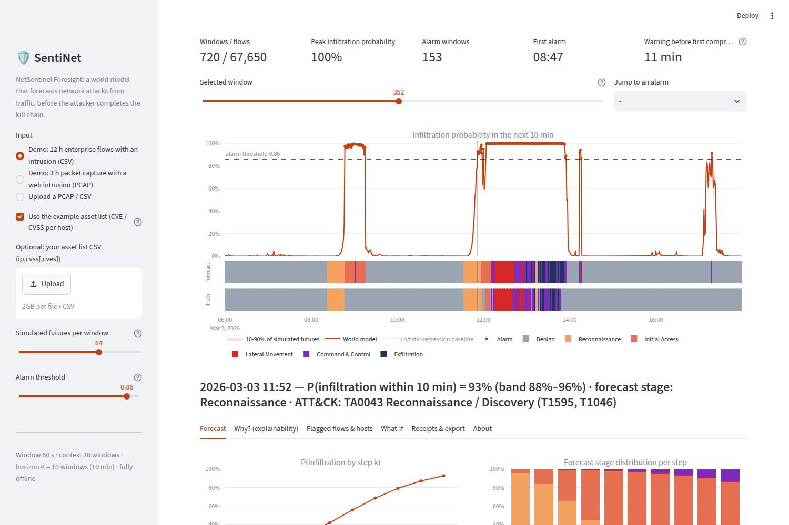
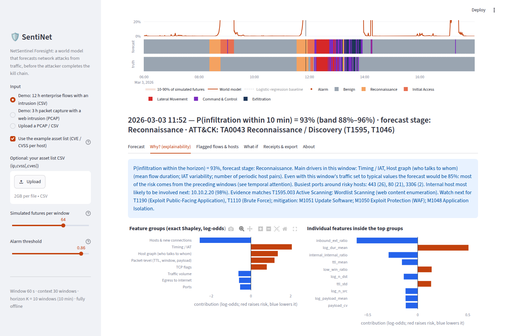
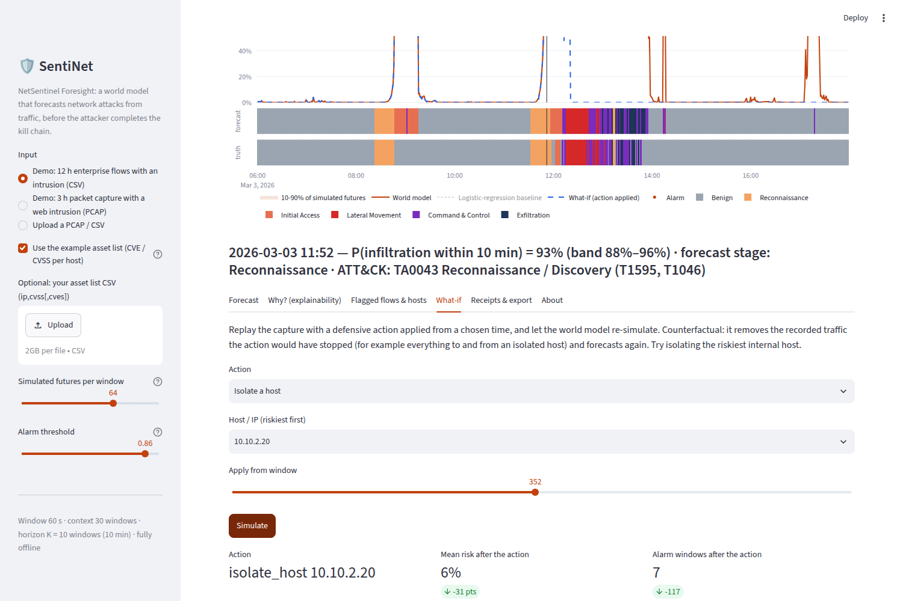

# SentiNet

**A world model that forecasts network attacks from traffic, before the attacker finishes the kill chain.**
Smart India Hackathon 2026 · Problem statement **SIH26153**, *AI based Network Attack Forecasting from Network Traffic Data* (NTRO) ·
Team **Resurrección** (Team ID 149775)

SentiNet does not label single flows as benign or malicious. It learns how the state of the network changes from one
minute to the next, **P(S<sub>t+1</sub> | S<sub>≤t</sub>)**. It then rolls that model forward 64 times per window and reports:

* **P(infiltration in the next K windows)**, a probability timeline with a confidence band;
* the **predicted MITRE ATT&CK stage**: Reconnaissance, Initial Access, Lateral Movement, Command & Control or Exfiltration;
* **why**: exact Shapley values over flags, ports, timing, TTL and the other features, plus temporal attention over the
  last 30 minutes;
* **which flows and hosts** to look at, a **what-if** simulator for defensive actions, and **signed, tamper-evident receipts**
  for every forecast.

It runs **fully offline on an ordinary CPU**: no cloud and no API calls.

📘 **New to the project? Read [`docs/SentiNet_Explained.md`](docs/SentiNet_Explained.md)**: a plain-language guide
to the idea, the demo story, the innovation, the results and likely judge questions.

---

## 1. Run it from the downloaded ZIP

1. On GitHub click **Code → Download ZIP** and unzip it. You get a folder like `SentiNet-main`.
2. Install **Python 3.10–3.13** from <https://www.python.org/downloads/>. On Windows, tick **"Add python.exe to PATH"**
   during setup.
3. Start the app:

   **Windows:** open the unzipped folder and double-click **`run_windows.bat`**.

   **Linux / macOS:** open a terminal in the unzipped folder and run:
   ```bash
   bash run.sh
   ```

   The first start creates a private environment in `.venv` and installs the dependencies. This takes about 5 minutes
   and needs internet once. After that, the app opens at **<http://localhost:8501>**, and later starts are offline and
   take seconds.
4. In the app, pick **"Demo: 12 h enterprise flows with an intrusion"** or the PCAP demo, or upload your own capture.

<details>
<summary><b>Manual setup (any OS)</b></summary>

```bash
cd SentiNet-main
python -m venv .venv
# Windows:  .venv\Scripts\activate        Linux/macOS:  source .venv/bin/activate
pip install -r requirements.txt
python -m sentinet app                    # opens http://localhost:8501
```
On Linux, `pip install torch --index-url https://download.pytorch.org/whl/cpu` before the line above avoids
downloading several GB of GPU libraries.
</details>

<details>
<summary><b>Troubleshooting</b></summary>

* *"Python was not found"*: reinstall Python with "Add python.exe to PATH" ticked, or install it from the Microsoft Store.
* *The browser did not open*: go to <http://localhost:8501> yourself.
* *Port 8501 is busy*: `python -m sentinet app --port 8502`.
* *Behind a proxy*: set `HTTPS_PROXY` before the first run so pip can download packages.
* To reinstall from scratch, delete the `.venv` folder and run the launcher again.
</details>

## 2. What you see in the app

| Screen | What it shows |
|---|---|
| **Timeline** | P(infiltration within the next 10 min) per minute, with the 10–90 % band of simulated futures, the alarm threshold, the forecast stage strip, the ground-truth strip when the input is labelled, and the logistic-regression baseline (click it in the legend) |
| **Forecast** | For the selected window: P(infiltration by +1…+10 min), the stage distribution at every future step, the current stage, and the network state the model predicts for the next minute |
| **Why?** | Exact Shapley values by feature group and by feature (log-odds), temporal attention over the last 30 windows, TCP-flag counts and the busiest ports around risky hosts, as a one-paragraph explanation |
| **ATT&CK / CAPEC / CVE** | Inside "Why?": the ATT&CK techniques and CAPEC patterns the evidence points to (with the trigger), the techniques to expect next with ATT&CK mitigations, and host risk raised by known CVEs from an optional asset list (`ip,cvss,cves`; example in `samples/demo_assets.csv`) |
| **Flagged flows & hosts** | The flows to look at first (anomaly × host risk, with reasons such as "SYN never answered" or "internal remote-service port 445") and the hosts most likely to be involved next |
| **What-if** | Block a port, isolate a host or block an IP from a chosen time, re-simulate, and compare the two timelines |
| **Receipts & export** | Forecast CSV, plus a receipt file signed with Ed25519 over a Merkle tree that anyone can verify later |

## 3. Command line

```bash
python -m sentinet forecast -i samples/demo_web_intrusion.pcap.gz --labels samples/demo_web_intrusion_labels.csv \
       --assets samples/demo_assets.csv -o report
#   -> report/report.html (offline, interactive), forecast.csv, alarms.csv, flagged_flows.csv,
#      explanations.json, receipts.json
python -m sentinet verify report/receipts.json          # re-check the signed receipts
python -m sentinet extract -i capture.pcap -o flows.csv  # PCAP -> flow + packet-level features (Scapy / built-in reader)
python -m sentinet generate -o data/synthetic --scenarios 48
python -m sentinet train -d data/synthetic -o weights
python -m sentinet benchmark -d data/test -o results
python -m pytest -q                                      # tests (pip install pytest)
```

## 4. Train on the public datasets

Put one capture per file in a folder and point `train` at it. Each file is treated as a separate time series. The
format is detected automatically; `--format` overrides it.

| Dataset | Files to use | Notes |
|---|---|---|
| CIC-IDS2017 | `GeneratedLabelledFlows/TrafficLabelling/*.csv` | Needs the files **with** Timestamp and IPs. The 12-hour clock without AM/PM in these files is fixed automatically |
| CSE-CIC-IDS2018 | `Processed Traffic Data for ML Algorithms/*.csv` | Most files have no IP columns, so the host graph is empty and only the state vector is used |
| CTU-13 | `*.binetflow` (Argus bidirectional flows with labels) | TCP flags come from the Argus `State` field |
| UNSW-NB15 | `UNSW-NB15_1.csv` … `_4.csv` (raw, 49 columns) | TTL, TCP window, loss (retransmissions) and jitter are used |
| Any PCAP | `.pcap`, `.pcapng` (or `.gz`) | Label with a rules CSV: `start,end,ip,stage[,peer,port,label]` |

```bash
python -m sentinet train -d data/cicids2017 --val data/cicids2017_val -o weights_cic --window 60 --horizon 10
python -m sentinet benchmark -d data/cicids2017_test --weights weights_cic -o results_cic
```

How labels map to stages is in `sentinet/stages.py`. For example, PortScan → Reconnaissance, Patator/Brute Force/Web
attacks/Exploits → Initial Access, Infiltration/Worms → Lateral Movement, Bot/Botnet/Backdoor → Command & Control,
DoS/DDoS → Impact.

**On Kaggle:** open [`notebooks/sentinet_kaggle_train.ipynb`](notebooks/sentinet_kaggle_train.ipynb), attach the datasets,
turn Internet on and Run All. It finds the files, trains one model per dataset, benchmarks it against logistic
regression and zips the weights and results.

## 5. Results

All numbers are on **held-out simulated scenarios**: captures the model never saw, whole 12-hour scenarios, split by
scenario and never by random rows. Target: *infiltration activity (Initial Access, Lateral Movement, C2 or Exfiltration)
in the next 10 minutes*, forecast every minute. Reproduce with `python scripts/reproduce_results.py`; the full tables are
in [`results/benchmark.md`](results/benchmark.md).

**Test 1: 30 unseen scenarios, all attack types** (21,000 forecast windows)

| Model | Precision | Recall | F1 | False-positive rate | ROC-AUC | Compromises warned in advance | Median warning |
|---|---|---|---|---|---|---|---|
| **World model (ours)** | **0.846** | **0.885** | **0.865** | **0.031** | **0.974** | **13/22** | **14 min** |
| Logistic regression, same features, same false-positive rate | 0.696 | 0.370 | 0.483 | 0.031 | 0.788 | 7/22 | 0 min |
| Logistic regression at its own best-F1 threshold | 0.435 | 0.577 | 0.496 | 0.144 | 0.788 | 18/22 (noisy) | 1 min |
| World model with its **history shuffled** | 0.224 | 0.765 | 0.347 | 0.510 | 0.672 | - | - |

* The world model's F1 is **1.8x** the baseline's at the same false-positive rate. It warns before
  13 of 22 compromises, against
  7 for the baseline. Of the 9 compromises it misses, 6 are phishing campaigns, which have no network precursor to forecast from; 2 are
  low-and-slow APTs and 1 is a web exploit.
* **Shuffling the order of the past windows destroys the model** (F1 0.86 → 0.35, false positives
  ×16). It really forecasts from temporal dynamics; it is not a static classifier in disguise.
* Current-stage detection macro-F1 is 0.90. Forecasting the exact ATT&CK stage is
  harder: macro-F1 is 0.68 one minute ahead and
  0.46 ten minutes ahead.

**Test 2: an attack pattern the model never saw.** A second model was trained without any low-and-slow APT campaign
(slow distributed scan, a single exploit, 5–15-minute beacons, trickle exfiltration), then tested on 16 scenarios that
contain one.

| Model | Precision | Recall | F1 | FPR | ROC-AUC |
|---|---|---|---|---|---|
| **World model (never saw slow APT)** | **0.929** | 0.335 | **0.492** | **0.011** | **0.791** |
| Logistic regression at the same FPR | 0.648 | 0.047 | 0.088 | 0.011 | 0.582 |
| Logistic regression, own threshold | 0.449 | 0.167 | 0.243 | 0.090 | 0.582 |

It generalises **partially**. Alarms are precise, and F1 is double the baseline's, but recall is only
33% and the model gave **no advance warning** of these compromises. With slow APT in the training data
(reference row in `results/benchmark.md`), F1 is 0.86.

**Speed (4-core laptop-class CPU, no GPU):** 12 h of traffic (67,650 flows) → 720 forecasts × 64 simulated futures in
about 2 s. A 441,000-packet PCAP is parsed in 2.7 s. Explaining one window with exact Shapley values takes about 0.1 s.


*Demo CSV. The forecast rises during reconnaissance, 11 minutes before the first compromise. The earlier alarm
(08:47) follows a real web scan and enumeration that never turned into an intrusion.*


*Why: exact Shapley values per feature group and per feature, the narrative, and ATT&CK / CAPEC evidence with mitigations.*


*What-if: isolating the web server at the first warning cuts the mean risk afterwards by 31 points and the alarm windows from 124 to 7.*


## 6. How it answers the problem statement

| Requirement (SIH26153) | Where |
|---|---|
| Ingest CIC-IDS / CTU-13 CSV and raw PCAP (Scapy) → timestamped, normalised feature matrix, flow + packet level | `sentinet/io/`, `sentinet/features/windows.py`, `python -m sentinet extract` |
| Network state as a feature vector **and** a graph | 47-feature state vector + host graph per window |
| Learn P(S<sub>t+1</sub> \| S<sub>t</sub>) with LSTM/Transformer/GNN, not a static classifier | `sentinet/models/world_model.py`: GraphSAGE + causal Temporal Transformer + stochastic latent GRU dynamics, trained on multi-step imagined futures |
| Supervised dynamics learning from attack timelines | `sentinet/train.py`, `sentinet/dataset.py` |
| K-step forward simulation → infiltration probability timeline | `Forecaster.run_windows`: 64 rollouts × K steps |
| Predicted ATT&CK stage | stage decoder at every rollout step, `sentinet/stages.py` |
| Driving features (flags, ports, flow patterns) via SHAP / attention | exact Shapley values (`engine.explain`), temporal and graph attention, flagged flows |
| Generalise to unseen attacks | leave-one-attack-type-out benchmark (section 5) |
| Offline demo interface for a PCAP/CSV with a timeline, flagged flows and stages | `app.py` (Streamlit, localhost only), `report.html` |
| Benchmark vs logistic regression (F1, precision, recall, FPR) | `python -m sentinet benchmark`, `results/benchmark.md` |
| Training scripts, weights, reproducible config | `python -m sentinet train`, `weights/` (config in `weights/meta.json`), `scripts/make_samples.py`, `scripts/reproduce_results.py` |
| Enterprise and Critical Information Infrastructure | passive, offline, CPU-only; signed receipts for audit; see `docs/ARCHITECTURE.md` |

## 7. Project layout

```
app.py                  Streamlit interface (offline)
run_windows.bat run.sh  one-click launchers
sentinet/
  io/                   loaders (CIC, CTU-13, UNSW-NB15, canonical CSV) and the PCAP extractor
  features/windows.py   flows -> per-window state vector + host graph
  models/world_model.py the world model
  models/baseline.py    logistic regression baseline, flow anomaly scorer
  dataset.py train.py   targets, batches, training
  engine.py             forecasting, Shapley explanations, flagged flows, what-if
  benchmark.py          world model vs baselines
  knowledge.py          MITRE ATT&CK / CAPEC knowledge base, CVE exposure
  ledger.py             Merkle tree + Ed25519 forecast receipts
  synth/                enterprise network + attack campaign simulator, PCAP writer
weights/                trained model (world_model.pt, meta.json, baselines.joblib)
samples/                demo CSV, demo PCAP + its ground-truth labels, example asset list (CVE/CVSS)
results/                benchmark tables
docs/ARCHITECTURE.md    architecture document (2 pages)
docs/SentiNet_Explained.md  plain-language guide for the team
ppt/                    SIH idea-submission deck (.pptx / .pdf) and its generator
tests/                  pytest suite
```

## 8. Honest limits

* **The shipped weights were trained on the bundled simulator**, because the public datasets could not be downloaded
  inside the build environment. The simulator is built to be hard to game:
  * hard negatives: an admin doing RDP/SSH/WinRM daily, nightly cloud backups, periodic telemetry, an internal
    inventory scan, and internet scanners that never follow up;
  * failed attacks and recon-free phishing;
  * a low-and-slow APT that is held out to test generalisation.

  It is still a simulator. Numbers on real traffic need retraining with the loaders above.
* Detection relies on flow shape and packet headers only. Nothing is decrypted, and payload content is never read.
* The what-if is a counterfactual: it removes the traffic an action would have stopped and re-runs the model. The
  model was not trained on defender actions.
