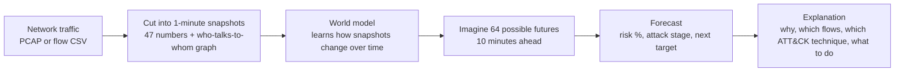
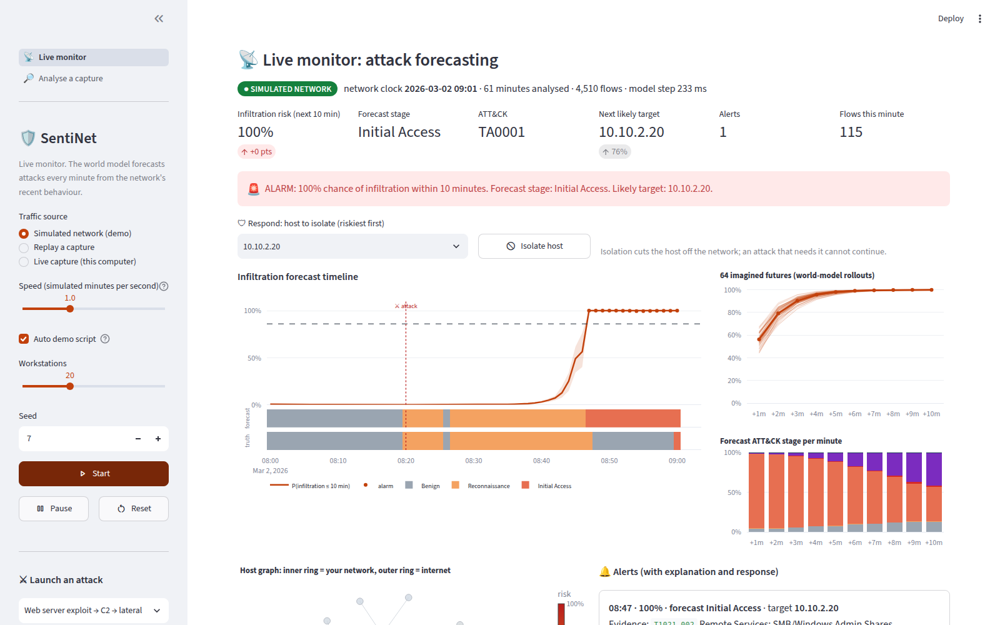
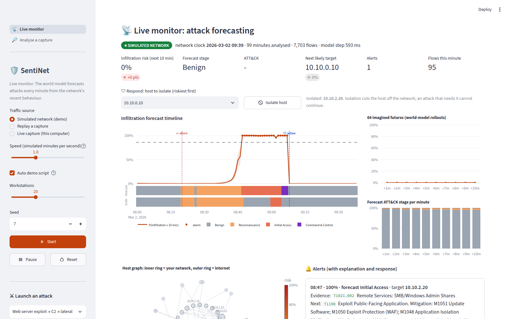

# SentiNet, explained

*A guide for the team and anyone curious. No background in machine learning needed.*

**Team Resurrección · Smart India Hackathon 2026 · Problem statement SIH26153 (NTRO):
"AI based Network Attack Forecasting from Network Traffic Data"**

---

## 1. The problem in one paragraph

Most security tools behave like a burglar alarm: they go off **after** someone is already inside. Real cyber-attacks are
not one event, though. They unfold over minutes to hours:

1. the attacker **scans** the network;
2. **breaks in**;
3. **moves sideways** to other computers;
4. sets up a **remote-control channel**;
5. **steals data**.

NTRO asks for an AI that watches network traffic, understands how the network behaves over time, and **predicts where
the attack is going before it finishes**. It also has to explain its reasoning and run on enterprise and
critical-infrastructure networks: power grids, banks, telecom, government.

## 2. Our answer in one line

> **SentiNet is a weather forecast for cyber-attacks.** Every minute it says: *"There is a 93 % chance an attacker gets
> inside in the next 10 minutes, they are in the reconnaissance stage now, this is the server they will hit, and this is
> why."*

The product, the slides and the code repository are all called **SentiNet**.

## 3. How it works, in plain words

1. **Read the traffic.** SentiNet takes a packet capture (PCAP) or a flow log (CSV) and turns it into a list of
   connections: who talked to whom, on which port, how many bytes, which TCP flags, how long, and so on.
2. **Take a snapshot every minute.** Each minute becomes a "state of the network":
   - **47 numbers**, for example how many connections failed, how many ports one computer touched, whether traffic
     looks periodic (like malware "beaconing"), how much data left for the internet, and packet details such as TTL
     and TCP window size;
   - **a small graph** of the busiest computers and who talked to whom.
3. **Learn how the network changes (the "world model").** A neural network watches the last 30 minutes of snapshots and
   learns how one minute leads to the next. In maths: P(next state | current state), written P(St+1 | St).
   This is the idea behind "world models" in AI research: learn an internal simulation of the world and use it to
   imagine the future.
4. **Imagine the future.** From the current minute, the model plays the future forward 10 minutes, **64 different ways**
   (the future is uncertain, so it samples). If 60 of the 64 imagined futures end in an attacker being inside, the risk
   is about 94 %. The spread between the futures gives a confidence band.
5. **Name the stage.** Every forecast is mapped to the stages defenders use worldwide, from the **MITRE ATT&CK**
   framework: Reconnaissance → Initial Access → Lateral Movement → Command & Control → Exfiltration.
6. **Explain it.** The app shows:
   - which features pushed the risk up or down (Shapley values);
   - which of the past minutes the model paid attention to;
   - the suspicious connections (flagged flows);
   - which ATT&CK techniques the evidence matches, and the recommended mitigation.

## 4. The demo story (what we show judges)

### 4.1 The live dashboard (use this for the video)

Start the app. It opens on **📡 Live monitor**. Keep **Simulated network** + **Auto demo script** on and press
**Start**. One simulated minute passes every second, so the whole story takes about 90 seconds:

1. **08:00–08:20 · normal office traffic.** Risk ≈ 0 %.
2. **08:20 · an attacker starts scanning** the company's web server (red "✕ attack" marker). The stage strip turns
   orange (Reconnaissance), and the risk curve starts to bend upward as the scanning looks more and more like the
   run-up to a break-in.
3. **08:47 · ALARM.** 100 % chance of infiltration within 10 minutes, forecast stage *Initial Access*, likely target
   10.10.2.20 (the web server). The alert explains itself: ATT&CK evidence, the technique expected next, and the
   mitigation for it.
4. **08:58 · the real break-in** happens (look at the ground-truth strip). **We warned 11 minutes earlier.**
5. **Press "Isolate host".** The riskiest host is already selected. The web server is cut off, the attack chain
   breaks, and the risk falls to 0 % (blue "🛡 action" marker). *Forecast → explanation → action → result, live.*

While it runs, point at:
- the **64 imagined futures** fan: the world model literally simulating the next 10 minutes;
- the **host graph**: inner ring = our network, red = at risk;
- the **heatmap** of what the model sees;
- the **"How it is working right now"** strip, which counts the signed receipts.

The sidebar can launch other attacks (phishing, brute force, slow APT, failed attack, DDoS).

The same dashboard works on **real traffic**: choose **Live capture** (run as Administrator with Npcap on Windows,
or with sudo on Linux/macOS) or **Replay a capture** for any PCAP/CSV.

### 4.2 The 12-hour recording (Analyse a capture page)

We ship a 12-hour recording of a simulated company network. Here is what happens in it and what SentiNet does:

| Time | What really happens | What SentiNet shows |
|---|---|---|
| 06:00–08:20 | Normal office traffic | Risk stays near 0 % |
| 08:23–08:46 | An attacker scans the web server and probes it with hundreds of web requests, then **gives up** | Risk jumps to ~98 % right after the probing (08:47): "this usually leads to a break-in". Nothing follows, so the risk falls back. This is a realistic, explainable alarm on a real but failed attack |
| 11:33–11:57 | A second attacker scans and probes the web server | At **11:52** the risk hits **93 %**, forecast stage "Reconnaissance", with Initial Access expected next |
| **12:03** | **The attacker breaks in** (exploit + reverse shell) | Already alarmed, **11 minutes of warning** |
| 12:10–13:45 | Remote-control beacons, lateral movement to the database and file server, data theft | Risk stays at ~100 %; stages shown live; the web server flagged as the host most likely to be involved |
| What-if | "What if we had isolated the web server at 11:52?" | Alarm windows afterwards drop from **124 to 7**; mean risk −31 points |

There is also a **3-hour PCAP demo** (real packet-capture format) where the alarm fires **18 minutes before** the
break-in, while the attacker is still scanning.

Screenshots are in [`docs/img/`](img/).

## 5. Innovation and what makes us different

### 5.1 Forecasting, not detection
Classic intrusion detection labels each connection "good" or "bad" after it happens. SentiNet predicts **what happens
next**: the chance of infiltration in the next 10 minutes, and the stage. That gives defenders time to act while the
attacker is still scanning.

### 5.2 A real world model, and proof that it uses time
Anyone can say their model "understands time". We test it on every result: we **shuffle the order of the past
minutes** and run the same model again.
- **Unshuffled:** F1 0.865.
- **Shuffled:** F1 drops to 0.347, and false alarms go up 16×.

So the model really learns how attacks unfold over time. It is not a static classifier in disguise. Few teams will
show this.

### 5.3 An "attack weather forecast" with uncertainty
Instead of one yes/no answer, we simulate **64 possible futures** and report a probability with a confidence band, plus
how the risk grows minute by minute (+1 min, +2 min … +10 min). The probability can only grow with the horizon, which is
guaranteed mathematically by how the model is built (a "hazard" formulation). So the forecasts are always consistent.

### 5.4 Two levels of traffic, fused, on a graph
- **Flow level:** bytes, packets, durations, TCP flags, inter-arrival times.
- **Packet level:** TTL, TCP window size, fragments, payload sizes, retransmissions, sequential versus random port order.

A slow, sneaky scan can stay under flow-count alarms and still give itself away at packet level. For example, scanner
tools send SYNs with a tiny 1024-byte TCP window. The **host graph**, analysed by a graph neural network, lets the model
say **which computer is likely to be hit next**.

### 5.5 Explanations that actually add up
We compute **exact Shapley values**, the maths behind SHAP. We test all 256 combinations of the 8 feature groups, so the
contributions add up exactly to the forecast. We do this in log-odds, directly from the model's hazard scores, so the
explanations stay meaningful even when risk is near 100 %. On top of that:
- **temporal attention:** which past minutes mattered;
- **graph attention:** which hosts mattered;
- **a plain-English paragraph**, for example: "Even with this minute's traffic set to normal, the forecast would be 85 %:
  most of the risk comes from the preceding minutes."

The problem statement says "black-box outputs are not acceptable". We answer that directly.

### 5.6 Speaks the defender's language: ATT&CK, CAPEC, CVE
A built-in knowledge base turns evidence into named techniques, attack patterns and fixes. For example:
- "T1046 Network Service Discovery, CAPEC-300 Port Scanning: one source probed 33 ports in sequential order";
- "watch next for T1190 Exploit Public-Facing Application; mitigation M1051 Update Software, M1050 WAF".

An optional asset list with known vulnerabilities (CVE / CVSS scores from NVD) **raises the risk of vulnerable hosts**.
An unpatched server is more likely to be the next victim.

### 5.7 A what-if defence simulator
Pick an action (isolate a host, block an IP, block a port) and a time, and SentiNet re-runs the forecast without the
traffic that action would have stopped. A SOC analyst can test a response before touching the real network.

### 5.8 Tamper-proof forecasts (fits our "Blockchain & Cybersecurity" theme)
Every forecast is hashed into a **Merkle tree**, the same structure behind blockchains and certificate-transparency
logs, and the root is signed with **Ed25519**. Anyone can later verify that no forecast was changed, added or deleted
(`python -m sentinet verify receipts.json`). That makes the AI **auditable**: you can check later whether its
predictions came true. This matters for CERT-In reporting and for critical infrastructure.

### 5.9 Built for critical infrastructure
- **Offline:** no cloud and no internet needed after setup.
- **Passive:** it only reads copies of traffic and never sends anything back.
- **Cheap:** about 170,000 parameters; 12 hours of traffic is forecast in **~2 seconds on a normal laptop CPU**; no GPU.

### 5.10 We test our own claims honestly
- The training network (a simulator we built) includes **hard negatives**:
  - an admin who uses RDP/SSH every day;
  - nightly cloud backups (they look like data theft);
  - regular software "check-ins" (they look like malware beacons);
  - a nightly inventory scan;
  - internet scanners that never follow up.
- It also includes **failed attacks** and **phishing with no warning signs**, so "scan = attack" does not work.
- We test on an **attack type the model never saw** and report the result even though it is only partly good.

### How we compare

| | Forecasts the next stage | Learns time dynamics | ATT&CK mapping | Explains each output | Offline | Signed, verifiable output |
|---|---|---|---|---|---|---|
| **SentiNet** | ✅ 10-min probability | ✅ world model | ✅ per forecast | ✅ Shapley + attention + text | ✅ | ✅ Merkle + Ed25519 |
| Snort / Suricata | ❌ | ❌ rules | partial (rule tags) | rule name only | ✅ | ❌ |
| ML flow classifiers | ❌ | ❌ one flow at a time | ❌ | sometimes | ✅ | ❌ |
| Commercial NDR / SIEM | risk scores, not stage forecasts | varies | ✅ | partial | often cloud | not standard |

## 6. Results (honest version)

All numbers come from the included simulator, on **held-out scenarios the model never saw**, split by whole 12-hour
recordings. Target: "will there be infiltration in the next 10 minutes?", asked every minute.

**Test 1: 30 unseen scenarios, all attack types**

| Model | Precision | Recall | F1 | False-alarm rate | Compromises warned in advance |
|---|---|---|---|---|---|
| **SentiNet world model** | **0.846** | **0.885** | **0.865** | **3.1 %** | **13 of 22** (median 14 min early) |
| Logistic regression (required baseline), same false-alarm rate | 0.696 | 0.370 | 0.483 | 3.1 % | 7 of 22 |
| SentiNet with the history shuffled | 0.224 | 0.765 | 0.347 | 51 % | – |

- About **1.8× better F1** than the baseline at the same false-alarm rate, and nearly twice as many attacks caught in
  advance.
- Of the 9 attacks it did not warn about, **6 were phishing**. Phishing starts with an email, so there is nothing on the
  network to forecast from. Once the phishing malware calls home, SentiNet forecasts the next stages.

**Test 2: an attack type the model never saw** (a "low-and-slow" APT: a very slow scan, one exploit, rare beacons)

| Model | Precision | Recall | F1 | False-alarm rate |
|---|---|---|---|---|
| **SentiNet (never trained on this attack)** | 0.929 | 0.335 | **0.492** | 1.1 % |
| Logistic regression, same false-alarm rate | 0.648 | 0.047 | 0.088 | 1.1 % |

It generalises **partly**. When it alarms it is almost always right, but it catches only a third of the attack
minutes and gave no advance warning on this type. We say this openly.

**Other facts worth knowing**
- **Detecting the current stage:** macro-F1 0.90. **Forecasting the exact stage 10 minutes ahead** is harder: 0.46.
- **Speed:** 12 h of traffic in ~2 s; a 441,000-packet PCAP parsed in 2.7 s; one explanation in ~0.1 s.
- **28 automated tests** pass. They cover the loaders, a PCAP round-trip, that Shapley values add up, and tamper
  detection.

## 7. How we meet every requirement in the problem statement

| NTRO asks for | We deliver |
|---|---|
| Ingest CIC-IDS / CTU-13 CSVs and raw PCAP (Scapy) into a timestamped, normalised feature matrix with flow + packet features | Loaders for CIC-IDS2017/2018, CTU-13, UNSW-NB15, PCAP/PCAPNG; `python -m sentinet extract` |
| Network state as a feature vector or graph | Both: 47 features + host graph every minute |
| Learn P(St+1 \| St) with an LSTM/Transformer/GNN, not a static classifier | GNN + Temporal Transformer + stochastic latent dynamics (GRU); the shuffled-history test proves it |
| Supervised dynamics learning from attack timelines | Dataset labels mapped to ATT&CK stages; the model learns the stage at every future step |
| Generalise to unseen attacks | Held-out attack-type test (Test 2) |
| K-step forward simulation → infiltration probability timeline | 64 rollouts × 10 steps, every minute |
| Predicted ATT&CK stage | For every future step, plus the technique names |
| Driving features via SHAP / attention | Exact Shapley values + attention + flagged flows |
| Offline demo interface (Streamlit / Flask / CLI) taking a PCAP or CSV | Streamlit app (live monitor on simulated / replayed / live-captured traffic + whole-capture analysis) + CLI + HTML report, 100 % offline |
| Benchmark vs logistic regression (F1, precision, recall, FPR) | `results/benchmark.md` |
| Training scripts, weights, reproducible config | `python -m sentinet train`, `weights/`, `scripts/reproduce_results.py` |
| Deliverables: code, README, 2-page architecture doc, 5-slide deck, 2-min video | Repo, `README.md`, `docs/ARCHITECTURE.md`, `ppt/` (**video still to record**) |

## 8. Tech stack

Python · PyTorch (the model) · Scapy + a fast built-in PCAP reader · pandas / NumPy · scikit-learn (baseline and flow
scorer) · Streamlit + Plotly (app) · `cryptography` (Ed25519 signatures). Everything runs on CPU.

**The model, for the curious:**
- GraphSAGE-style graph encoder with attention pooling;
- causal Transformer over the last 30 minutes;
- stochastic latent state with GRU dynamics (the "recurrent state-space model" idea from DreamerV3);
- decoders for the next state, the ATT&CK stage, the infiltration hazard and per-host risk;
- about 170k parameters.

## 9. Questions judges will probably ask, and our answers

**"Isn't this trained on fake data?"**
Yes, the shipped model was trained on our own network simulator, because the public datasets could not be downloaded
in our build environment. The simulator is deliberately hard: normal traffic that looks like attacks, failed attacks,
phishing without warning signs, and an attack type held out for testing. The loaders for CIC-IDS2017/2018, CTU-13 and
UNSW-NB15 are included, and one command retrains on them. Real-data numbers are our next step.

**"How is this different from a normal IDS?"**
An IDS tells you an attack happened. We forecast what happens next and how soon, with a probability, the stage and the
next target. The shuffled-history test proves the model uses time, not just the current minute.

**"What about encrypted traffic?"**
We never read contents. Everything comes from headers and timing: sizes, flags, ports, TTL, periodicity. Encryption does
not hide those.

**"False alarms?"**
3.1 % at the default threshold, which you can move with a slider. And the alarms are explained. In the demo, the
"early" alarm was a real attacker probing the server who gave up, which is exactly what an analyst wants to see.

**"Can it catch zero-days / unseen attacks?"**
Partly. On an attack type it never saw, it is precise (93 %) but catches a third of it, with no early warning. We show
this number instead of hiding it.

**"Why not just an LSTM classifier?"**
A classifier gives one label. A world model gives a whole distribution of futures, so we get uncertainty bands, a
minute-by-minute risk curve, stage forecasts and a what-if simulator from the same model.

**"Is the what-if real cause and effect?"**
It is a counterfactual on recorded traffic: we remove what the action would have blocked and re-forecast. The model was
not trained on defender actions, and we say so.

**"Does it scale to big networks?"**
Each minute takes milliseconds on a CPU. The graph keeps the 48 busiest hosts per minute. For large networks you run one
sensor per network segment, which is also how critical infrastructure is usually split.

**"Why blockchain?"**
Not a cryptocurrency: the same tamper-evidence idea. Forecasts are hashed into a Merkle tree and signed, so nobody,
including us, can quietly change a prediction afterwards. Auditors can check whether the AI was right.

## 10. How to run it

1. GitHub → **Code → Download ZIP** → unzip.
2. Install Python 3.10–3.13 (Windows: tick "Add python.exe to PATH").
3. Windows: double-click **`run_windows.bat`**. Linux/macOS: **`bash run.sh`**.
4. The first run installs everything (~5 min, needs internet). The app opens at **http://localhost:8501** on the
   Live monitor: press **Start** (section 4.1).
5. Need data? `python scripts/make_dataset.py` builds **SentiNet-Sim v1** (48 labelled 8-hour network recordings,
   ~1.9 M flows, 2 PCAPs) in about a minute. See [`DATASET_CARD.md`](DATASET_CARD.md).

For the command line, see the [README](../README.md).

## 11. Words you will hear

| Term | Meaning |
|---|---|
| **PCAP** | A recording of network packets (what Wireshark saves) |
| **Flow** | One conversation between two computers (a connection), summarised |
| **World model** | An AI that learns how its environment changes, so it can imagine the future |
| **MITRE ATT&CK** | The standard catalogue of attacker tactics (stages) and techniques, each with an ID such as T1046 |
| **CAPEC** | A catalogue of attack patterns, linked to ATT&CK techniques |
| **CVE / CVSS / NVD** | Known software vulnerabilities, their severity score (0–10), and the US database that lists them |
| **Precision** | Of the alarms, how many were real |
| **Recall** | Of the real attack minutes, how many we caught |
| **F1** | One number that balances precision and recall (1.0 is perfect) |
| **False-positive rate (FPR)** | How often we alarm when nothing is happening |
| **Shapley / SHAP** | A fair way to split a prediction into "how much each feature contributed" |
| **Attention** | Which past minutes (or hosts) the model focused on |
| **Merkle tree + Ed25519** | A hash tree and a digital signature that make records tamper-evident |
| **Lateral movement** | An attacker hopping from the first hacked computer to others |
| **C2 / beaconing** | Malware "phoning home" to the attacker at regular intervals |
| **Exfiltration** | Stealing data out of the network |

## 12. What is left for the team

- [ ] **Record the 2-minute demo video** (story: section 4.1, a screen recording of the live dashboard). Put the link on slide 6 of the deck (`ppt/build/deck.js` →
      "Demo Video") and rebuild, or edit the .pptx directly.
- [ ] **Train on one real dataset** (CIC-IDS2017 "GeneratedLabelledFlows" or CTU-13) and add its benchmark next to the
      simulator results.
- [ ] Rehearse the judge Q&A (section 9). Everyone should be able to explain sections 2, 3 and 5.2.
- [ ] Delete the old branch `claude/repo-review-requirements-8ylcw8` in the NetSentinel-TeamResurreccion repo
      (GitHub → Branches).
- [ ] Optional: try your own capture. Record 30+ minutes with Wireshark and upload the PCAP in the app.

## 13. Where things live in the repo

| Path | What |
|---|---|
| `README.md` | Setup and full results |
| `docs/ARCHITECTURE.md` | 2-page architecture document (SIH deliverable) |
| `docs/SentiNet_Explained.md` | This file |
| `ppt/SentiNet_SIH26153.pptx` / `.pdf` | The idea-submission deck |
| `app.py`, `ui/live.py`, `ui/analyse.py` | The web app: live dashboard + whole-capture analysis |
| `sentinet/live.py` | Live engine: simulated network, replay, real packet capture |
| `scripts/make_dataset.py`, `docs/DATASET_CARD.md` | The SentiNet-Sim v1 dataset builder and its card |
| `sentinet/` | All the code: loaders, features, model, engine, knowledge base, ledger, simulator |
| `weights/` | The trained model |
| `samples/` | Demo CSV, demo PCAP, its labels, and an example CVE asset list |
| `results/benchmark.md` | Every benchmark table |
| `tests/` | The automated tests |
